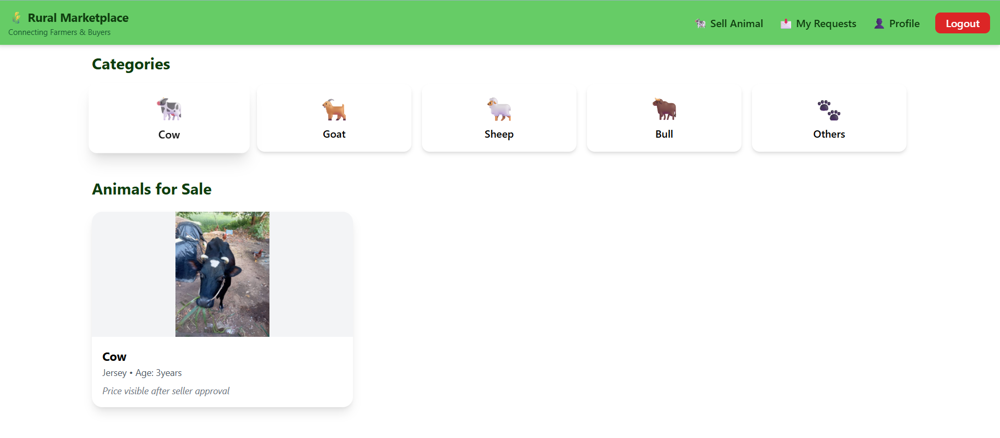
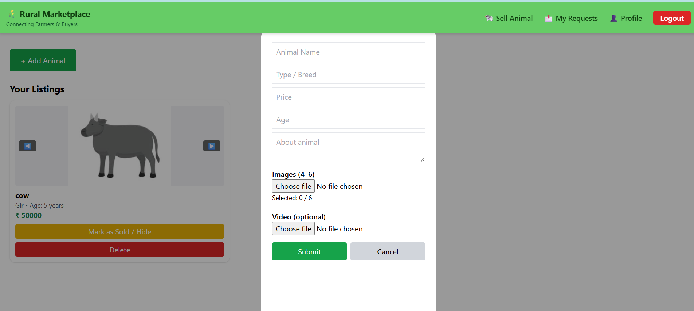
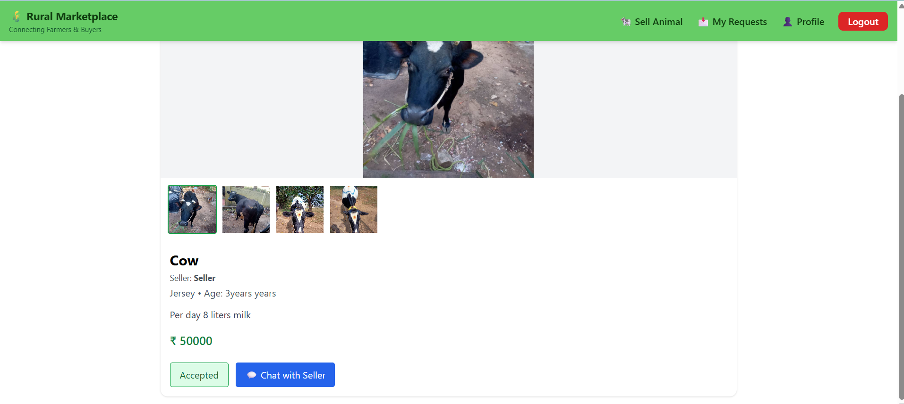
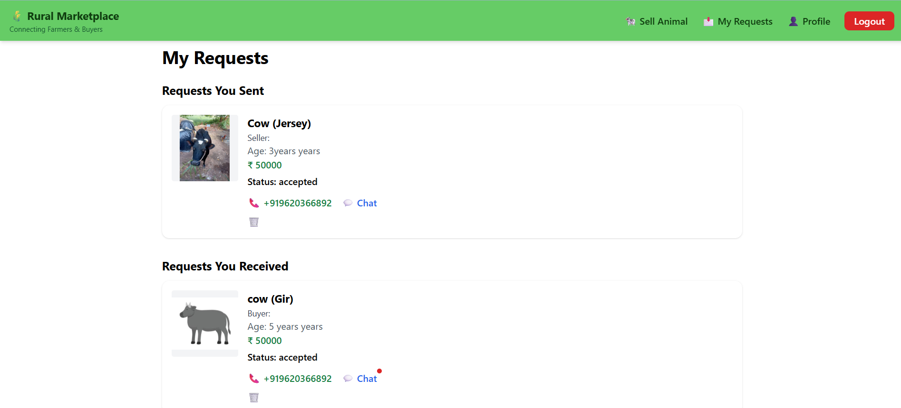

## 🐄 Rural Animal Marketplace

A web-based platform that connects rural animal sellers and buyers in a simple and secure way.
Farmers can list animals for sale, manage requests, and communicate directly with buyers, while buyers can explore listings, send requests, and chat after approval.

The platform focuses on transparency, ease of use, and digital access for rural markets.

## 📌 Overview

Rural Animal Marketplace is designed to digitize traditional rural animal trading.
Instead of depending on middlemen or physical markets, sellers can list animals online and buyers can directly connect with them through requests and in-app chat.

The platform ensures:

 - Controlled communication (only after request acceptance)

 - Price privacy until seller approval

 - Secure authentication using mobile number login

 - A smooth experience on both desktop and mobile devices

This project aims to empower rural sellers, reduce dependency on brokers, and make animal trading more transparent and efficient.

## 🚀 Features

🔐 Secure Authentication – Login using mobile number with Firebase Authentication

🐄 Animal Listings – Sellers can add animals with images, videos, age, breed, and description

🖼️ Image & Video Gallery – Multiple images with zoom support and optional video upload

📩 Request System – Buyers send requests to sellers instead of direct contact

🔒 Price Privacy – Animal price is visible only after the seller accepts the request

✅ Request Management – Sellers can accept or reject buyer requests

💬 Real-time Chat – In-app chat enabled after request acceptance

🔔 Unread Message Indicator – Notifications for unseen chat messages

📞 Call Option – Phone number visible only after request acceptance

🧑‍🌾 Seller Control – Sellers can hide or mark animals as sold

📱 Responsive UI – Optimized for mobile and desktop devices

🔥 Firebase Powered – Secure Firestore rules and real-time updates

## 📘 What I Learned

 - Built a full-stack web application using React and Firebase.

 - Learned React fundamentals like components, hooks, routing, and state management.

 - Designed and managed Firestore databases (users, animals, requests, chats).

 - Implemented authentication & role-based access control (buyer vs seller).

 - Developed a request-based buying system to protect user privacy.

 - Built a real-time chat system using Firebase.

 - Worked with image and video uploads using Firebase Storage.

 - Improved debugging, problem-solving, and real-world project skills.

## 🛠️ Tech Stack

## Frontend: 
  - React.js
  - HTML
  -  CSS
  -  JavaScript

## Backend & Database:
 - Firebase Firestore

## Authentication:
 - Firebase Authentication (Phone Login)

## Storage:
 - Firebase Storage (Images & Videos)

## Real-time Features: 
 - Firebase Realtime Updates (Chat & Requests)

## 🏗️ Architecture Diagram
.png>)

## 🔍 How it Works 

 - React Frontend handles UI and user interactions

 - Firebase Authentication manages secure phone-based login

 - Firestore Database stores animals, requests, users, and chat data

 - Firebase Storage stores images and videos of animals

 - Real-time listeners enable instant chat and request updates

## 📸 Output 

### 🏠 Home Page

### ➕ Sell Animal Page

### 🐾 Animal Details

### 📄 Requests Page

## 🤝 Conclusion

This project demonstrates how technology can empower rural communities by enabling direct, transparent, and secure animal trading through digital platforms.
